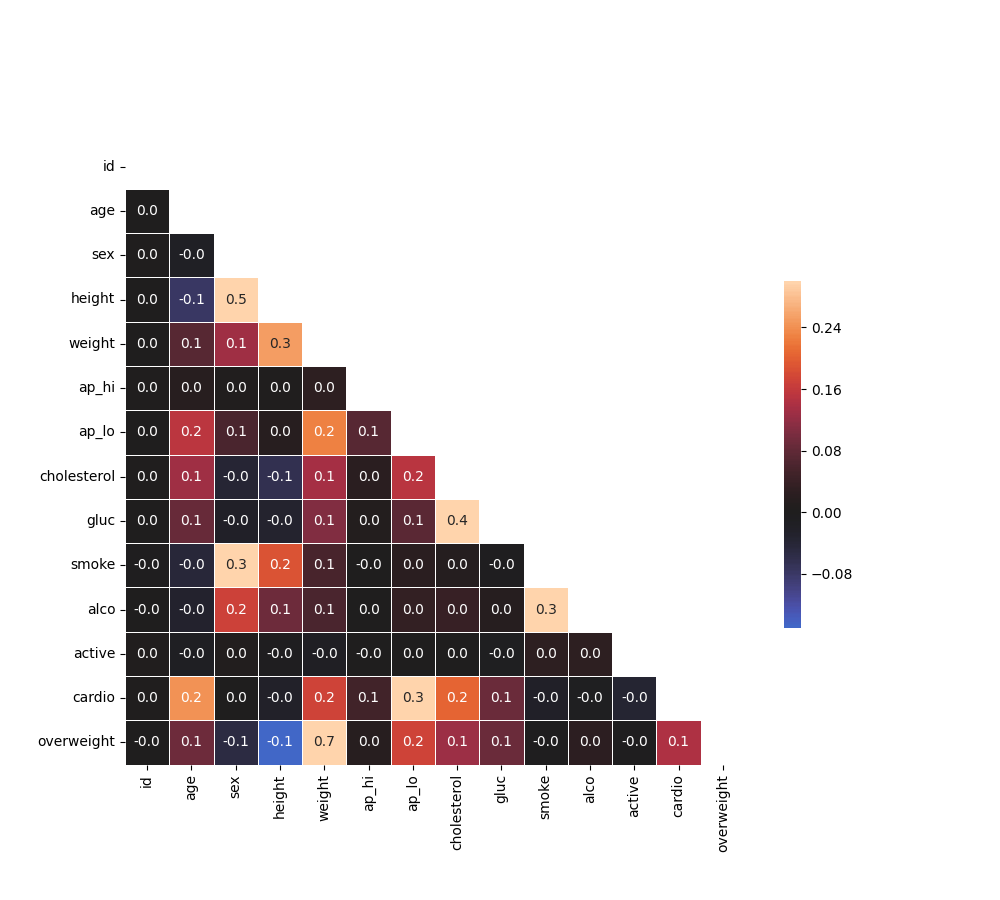

# Medical Data Visualizer

In this project, I visualized and made calculations from medical examination data using matplotlib, seaborn, and pandas. The dataset values were collected during medical examinations.

## Data description

The rows in the dataset represent patients and the columns represent information like body measurements, results from various blood tests, and lifestyle choices. I used the dataset to explore the relationship between cardiac disease, body measurements, blood markers, and lifestyle choices.

## Data visualizations

